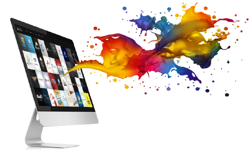
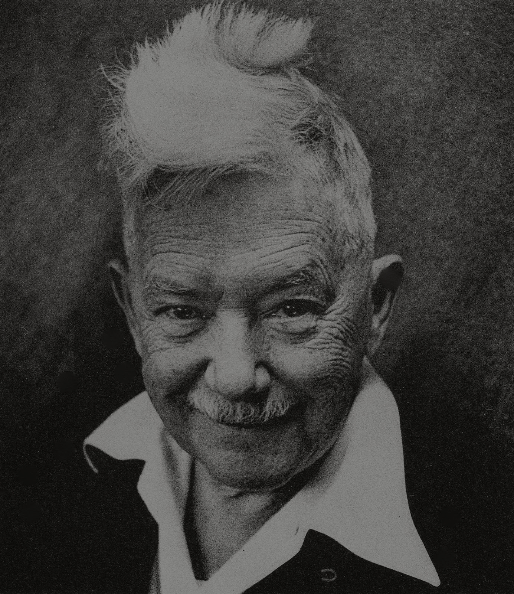
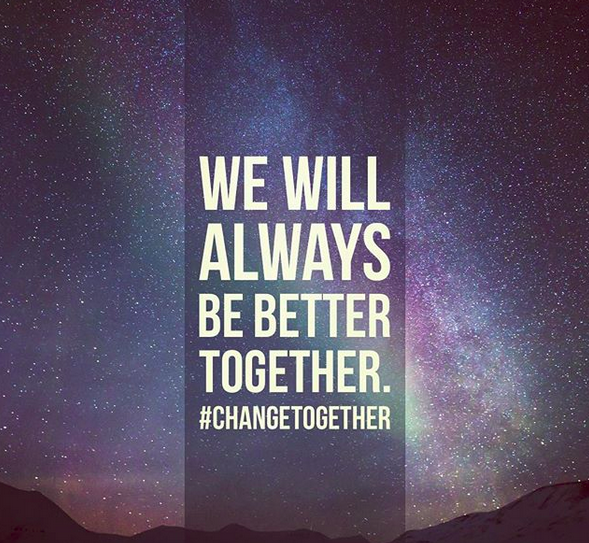
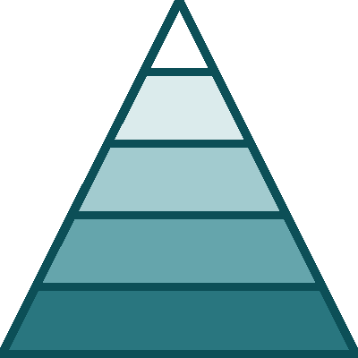

### Introdução ao Design Gráfico

_Autor: Andrew Ribeiro_

---

### Conteúdos

- O que é Design Gráfico?
- História
- Conceitos
- Prática

---

#### O que é Design Gráfico?

----

<!-- .slide: data-background-image="assets/about.jpg" -->

**De uma forma simples**

> O processo de resolução de um problema visual utilizando a tipografia,
as fotografia, as cores e a ilustração.

----

<!-- .slide: data-background-image="assets/visual.jpg" -->

O Design Gráfico é um subcampo da

### Comunicação Visual

O Design Digital é um subcampo do

### Design Gráfico

----

<!-- .slide: data-background-image="assets/creation.jpg" -->

Os designers criam ou combinam **símbolos**, **imagens** e **textos**
para representar uma ideia ou transmitir uma mensagem.

---

### História

----
<!-- .slide: data-background-image="assets/camaleao.jpg" -->

O termo **Design Gráfico** foi fundado em 1922 por

### William Addison Dwiggins

----

<!-- .slide: data-background-image="assets/lascaux.jpg" -->

No entanto, a verdadeira origem do **Design Gráfico** vem de há muito tempo atrás.

### Lascaux Cave, França.

_17 mil anos atrás_

----

<!-- .slide: data-background-image="assets/rosetta.jpg" -->

### Rosetta Stone, Egito.

_2 mil anos atrás_

----

<!-- .slide: data-background-image="assets/manuscript.jpg" -->

### Manuscritos Iluminados

_Mil anos atrás_

----

<!-- .slide: data-background-image="assets/brigade.jpg" -->

### Design Gráfico é quase tudo

---

### Conceitos

----

<!-- .slide: data-background-image="assets/concepts.jpg" -->

7 Conceitos Básicos de Design

_Adobe, 2016_

----

<!-- .slide: data-background="linear-gradient(67deg, rgba(0,0,0,1) 0%, rgba(91,85,85,1) 50%, rgba(69,63,63,1) 100%)" -->

### 1 - Alinhamento

----

### 2 - Hierarquia

----

<!-- .slide: data-background="linear-gradient(67deg, rgba(0,0,0,1) 0%, rgba(91,85,85,1) 50%, rgba(69,63,63,1) 100%)" -->

### 3 - Contraste

----

### 4 - Repetição

----

<!-- .slide: data-background="linear-gradient(67deg, rgba(0,0,0,1) 0%, rgba(91,85,85,1) 50%, rgba(69,63,63,1) 100%)" -->

### 5 - Proximidade

----

### 6 - Cores

----

### 7 - Espaço

---

<!-- .slide: data-background-image="assets/lamps.jpg" -->

> Comunicação não é só falar, ver ou ouvir, é fazer entender!

_Renato Ribeiro_
